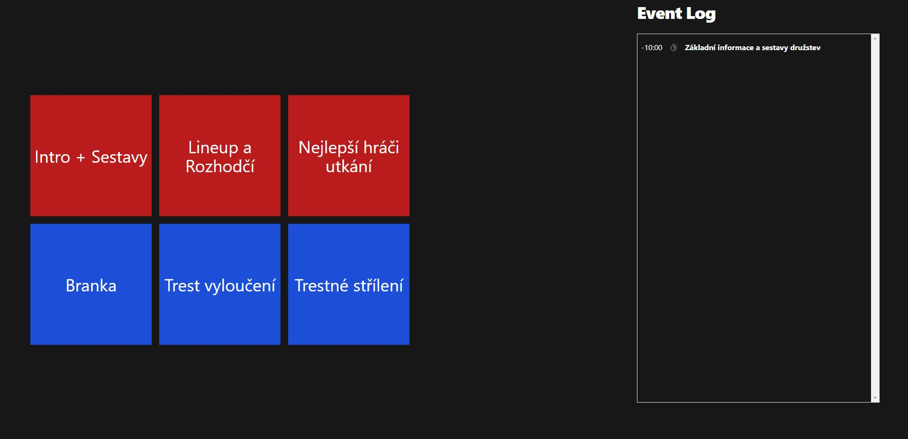
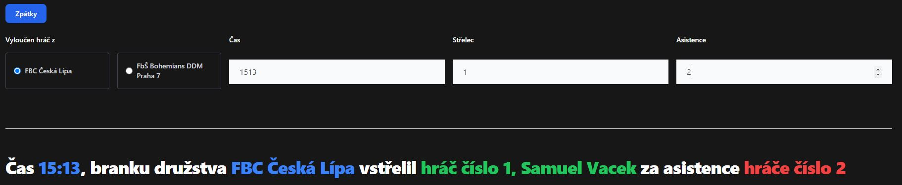
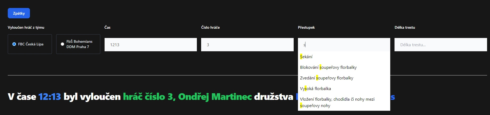

# Hlasatelna

Tahle sranda má pomoci hlasatelům florbalových utkání s jejich činností při utkání. Podle [předpisů](https://www.ceskyflorbal.cz/cfbu/predpisy/smernice), resp. [předpisů upravující činnost hlasatele při utkáních](https://www.ceskyflorbal.cz/dms/serve/assigned-file/215/) je povinností hlasatele informovat o

- Základních informací o utkání
- Sestavách družstev
- Brankách
- Trestech vyloučení
- Time-outech
- a trestných střílení

Vše až na time-outy referuje nějakým způsobem na hráče, a často jediné informace, které máme, jsou tým a číslo hráče, resp. hráčů. Z toho pro hlasatele plynou dvě možnosti, jak správně události hlásit společně s jmény hráčů

1. Počkat, než se informace dostane do online přenosu od zapisovatele
2. Být přisátej na FIS a lovit jména hráčů v ZOU

S první možností vzniká znatelné zpoždění, s tou druhou je to nepraktický (protože celej ZOU je nepraktickej, ale to je fuk). Proto jsem vytvořil **hlasatelnu**, jejichž cílem je automatizovat tenhle sběr dat a vytvořit rychlé rozhraní pro generování zpráv.

## Struktura
Hlasatelna se skládá ze dvou částí

1. **Hlasatelna Backend**, který sbírá data o utkání.
2. **Hlasatelna Frontend**, který zajištuje rozhraní pro vytváření zpráv 

## Závislosti
**Hlasatelna Backend** lze spustit dvěma způsoby - buďto pomocí zkompilované distribuce, nebo pomocí příkazové řádky.

1. Pro spuštění z příkazové řádky stačí spustit skript `run_deno.sh`, pro který je potřeba prostředí [Deno](https://deno.land/).
2. Pro spuštění pomocí zkompilované distribuce je zapotřebí mít stažený spustitelný soubor, který lze buďto získat zkompilováním pomocí Deno prostředí (viz skript `build.sh`), nebo stažením z repozitáře.

Verzi **hlasatelny** lze ověřit pomocí přepínače `--version`, nebo `-V`

```
hlasatelna --version
```

## Spuštění
Ať už pracujete s hlasatelnou jakkoliv, je potřeba mít `kód utkání` - zde může nastat nedorozumění, co se tím myslí. Kódem utkání v tomto případě není ten samý, který je napsaný ve FISu. Myslí se tím kód, pod kterým je evidován jeho online přenos.

Například utkání `https://online.ceskyflorbal.cz/20222023/online-326112.htm` nemyslím kód `8XJ1-Q029`, ale `326112`, který je v adrese online přenosu.

Spuštění backendu hlasatelny probíhá následovně

```sh
# Spuštění pomocí zkompilované distribuce

hlasatelna <kod_utkani> 
# stejné jako
run.sh <kod_utkani>


# Spuštění pomocí prostředí Deno

deno run --allow-net --allow-read=. ./hlasatelna.ts <kod_utkani>
# stejné jako
run_deno.sh <kod_utkani>
```

Backend by se vám měl na standardní výstup ohlásit s tím, o jaký zápas jaké soutěže se jedná, a na jakém portu jsou data dostupná. Jedná se čistě o kontrolní výpis, který vás až tak zajímat nemusí.

Pokud jste **hlasatelnu** spouštěli pomocí `*.sh` skriptů, byl vám automaticky spuštěn i Google Chrome (pokud ho teda máte) s úvodní stránkou, která slouží jako navigace.

Pokud jste **hlasatelnu** spouštěli jinak, otevřete soubor `index.html` ve svém prohlížeči (preferovaně Chrome, Firefox či jejich up-to-date deriváty).

## Použití
Po spuštění backendu a rozhraní **hlasatelny** je její použití přímočaré. Na hlavní stránce jsou dvě sady obřích tlačítek.
- Červeně vyznačené dlaždice jsou hlášení mimo hru, takže nástupy a ceremonie.
- Modře vyznačené dlaždice jsou hlášení o událostech během hry.

Na pravé straně se ještě nachází záznam událostí - Události jsou generovány pohybem po systému **hlasatelny** a nemusí korespondovat s online přenosem ve FISu.

> Úvodní stránka hlasatelny
> 

Na každé stránce je v podstatě scénář, který je doplněn aktuálními údaji, proto si dovolím přeskočit použití červených dlaždic, protože tam nic kromě čtení dělat nejde.

Stránky pro hlášení událostí v utkání se zpravidla skládá z opakujících se částí.
- Výběrem týmu
- Vstup pro čas události (píše se bez oddělovací dvojtečky)
- Vstup pro číslo hráče

Každý vstup koresponduje k části textu, podle kterého je patřičně vykreslen. Jak si jistě všimnete z obrázku níže, zpráva obsahuje několik barevných segmentů.
- Modré části značí takové, které jsou buďto přímo kopírovány ze vstupu, nebo pochází z dat backendu
- Zelené a červené části jsou používané pro vstupy, do kterých se zadává číslo hráče. 
    - Pokud je výstup **zelený**, znamená to, že číslo hráče bylo v patřičném týmu nalezeno a je tak doplněno i jeho jméno.
    - Pokud je výstup **červený**, znamená to, že číslo hráče **nebylo** v patřičném týmu nalezeno a známe tak jenom jeho číslo.

> Stránka pro hlášení branky
> 

Nespoléhám na to, že data z online-přenosu a statistik budou na 100% přesná, proto vás hlasatelna neseřve za to, že číslo hráče nejde spárovat s jménem. Dá vám ovšem jasně najevo, že nezná jméno tohoto hráče.

Trest vyloučení má dále také vstupní pole pro typ přestupku a délku trestu. Tyto vstupy jsou klasické textové, do kterých lze napsat úplně cokoliv, ovšem jako asistenci je zde dodán také našeptávač, který vám může zadávání urychlit. Pokud je první výsledek to, co hledáte, stačí stisknout klávesu `tab` a výsledek se automaticky doplní do vstupního pole. 

> Stránka pro hlášení trestného vyloučení
> 

---
## Něco nefunguje, kam to můžu hlásit?

Buďto otevřete issue v tomto repozitáři, nebo pište na e-mail, který mám uvedený na Github profile (nechci ho sem psát, abych to pak nemusel všude měnit :P).